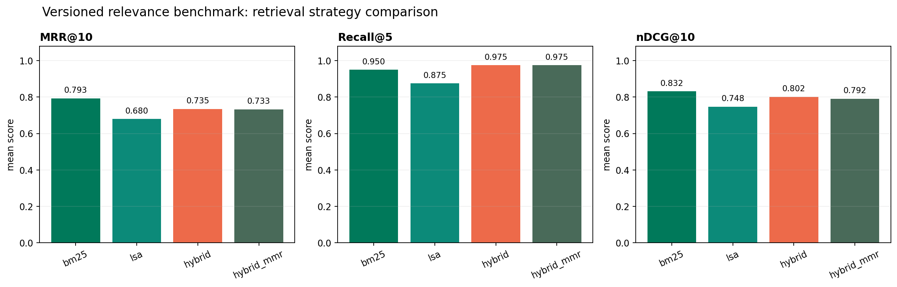
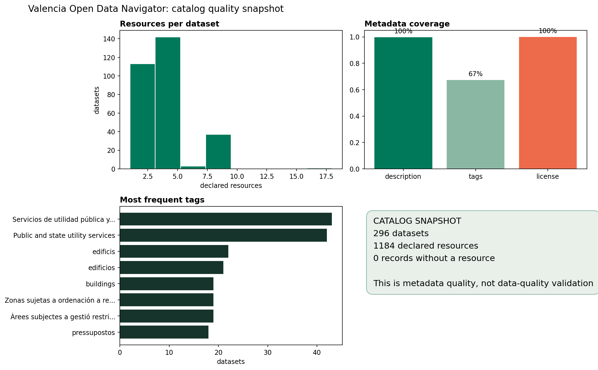

# Valencia Open Data Navigator

NLP retrieval system for discovering a versioned snapshot of public metadata from the Valencia CKAN catalog. The project combines lexical search, latent semantic analysis, reciprocal-rank fusion and diversity-aware reranking, then exposes the evidence through a Streamlit dashboard and FastAPI.

This is a portfolio project built from public catalog metadata. It is not an official City of Valencia search service, does not use a private or generative AI model, and does not claim to assess the quality, freshness or legal suitability of every linked resource.



## Problem

Municipal open-data catalogs are valuable but are frequently multilingual, unevenly tagged and difficult to browse with a short natural-language need. The question is:

> Can a transparent retrieval system improve discovery of versioned municipal metadata while exposing what the ranking is based on and where it fails?

## Architecture

```text
Valencia CKAN package_search API
             |
Compact snapshot + SHA-256 manifest
             |
Schema, duplicate and resource controls
             |
Spanish/Valencian text normalization
             |
BM25 + word/character TF-IDF + LSA
             |
RRF hybrid fusion + MMR diversification
             |
Manual relevance benchmark (20 queries)
             |
Streamlit explorer + FastAPI + reproducible reports
```

## Data

The included snapshot was fetched from the official [Valencia Open Data CKAN API](https://opendata.vlci.valencia.es/api/3/action/package_search) on 2026-07-13. It contains **296 datasets** and **1,184 declared resources**. The extraction stores discovery metadata only and intentionally omits portal contact fields and the contents of linked resources.

The committed [source manifest](data/raw/source_manifest.json) records the retrieval time, record count and SHA-256. Snapshot validation found no duplicate slugs, no missing titles and no records without a declared resource. Description coverage is 99.7%, tag coverage is 67.2% and license-title coverage is 100.0% in this snapshot.



## Retrieval methods

| Strategy | Method | Intended role |
|---|---|---|
| `bm25` | BM25 with `k1=1.5`, `b=0.75` | Lexical baseline with auditable term matches. |
| `lsa` | Word 1-2 grams plus character 3-5 grams, TF-IDF, TruncatedSVD and cosine similarity | Latent semantic and spelling-robust signal. |
| `hybrid` | Reciprocal-rank fusion of BM25 and LSA, `k=60` | Higher-recall union of both rankers. |
| `hybrid_mmr` | Hybrid candidates reranked with a 0.24 diversity penalty | Diverse top results when near-duplicates dominate. |

The dashboard returns the selected strategy, rank score, BM25/LSA/RRF components and normalized matched terms for every result.

## Observed benchmark results

The evaluation set contains 20 manually curated Spanish discovery queries mapped to official dataset slugs. It is versioned in [data/evaluation_queries.json](data/evaluation_queries.json) and is useful for regression testing, not as a general user study.

| Strategy | MRR@10 | Recall@5 | nDCG@10 |
|---|---:|---:|---:|
| BM25 | **0.793** | 0.950 | **0.832** |
| LSA | 0.680 | 0.875 | 0.748 |
| Hybrid | 0.735 | **0.975** | 0.802 |
| Hybrid MMR | 0.733 | **0.975** | 0.792 |

The point is deliberately not "hybrid wins everywhere": BM25 has the strongest first-relevant ranking on this small benchmark, while hybrid fusion recovers more labeled items in the top five. MMR preserves hybrid recall here but slightly reduces nDCG because it optimizes diversity rather than this relevance metric.

Per-query rankings and aggregate metrics are saved in [reports/evaluation_by_query.csv](reports/evaluation_by_query.csv) and [reports/evaluation_metrics.json](reports/evaluation_metrics.json).

## Application and API

Run the local explorer:

```powershell
streamlit run app.py
```

It includes discovery, benchmark, catalog-quality and use-boundary views. Results link to the official portal record rather than copying resource data into the app.

Run the API:

```powershell
python -m uvicorn src.api:app --reload
```

| Endpoint | Purpose |
|---|---|
| `GET /health` | Snapshot availability and catalog record count. |
| `GET /search` | Search with `query`, `strategy`, `limit` and optional `tag`. |
| `GET /datasets/{name}` | Inspect one dataset record from the snapshot. |
| `GET /evaluation` | Read the committed ranking metrics. |
| `GET /strategies` | List retrieval strategies. |

OpenAPI documentation is available at `http://localhost:8000/docs`. More detail is in [docs/API.md](docs/API.md).

## Installation

```powershell
python -m venv .venv
.\.venv\Scripts\Activate.ps1
python -m pip install -r requirements-dev.txt
```

## Reproducible execution

Use only the versioned snapshot, with no network request:

```powershell
python -m src.pipeline --offline
```

Refresh metadata deliberately, review the diff and rerun the benchmark before committing:

```powershell
python -m src.pipeline --refresh
```

## Quality checks

```powershell
python -m ruff check .
python -m pytest
python -m pip check
python -m src.pipeline --offline
```

The current suite has 7 tests covering text normalization, schema controls, deterministic retrieval, tag filtering, ranking evaluation and API contracts. GitHub Actions runs lint, tests and the offline pipeline on every pull request and on `main`.

## Structure

```text
src/        CKAN extraction, validation, retrieval, evaluation, reporting and API
tests/      unit, retrieval and API contract tests
data/       versioned metadata snapshot, manifest, labels and processed catalog table
reports/    ranking metrics, per-query outputs and generated figures
docs/       data card, methodology, retrieval card and API reference
app.py      Streamlit exploration interface
Dockerfile  local API container recipe
```

## Limits and responsible use

- The corpus is a snapshot and does not update itself while the app is running.
- Small manual relevance labels are for reproducibility and regression tests, not proof of universal quality.
- Scores rank metadata; they do not validate an underlying file, its current availability or its reuse terms.
- The project does not download linked resources, infer personal attributes or answer questions beyond the indexed metadata.

Read the [Data Card](docs/DATA_CARD.md), [Methodology](docs/METHODOLOGY.md) and [Retrieval Card](docs/RETRIEVAL_CARD.md) before reusing the work.

## Author

Developed by [0227lia](https://github.com/0227lia) as a Data Science portfolio project.
